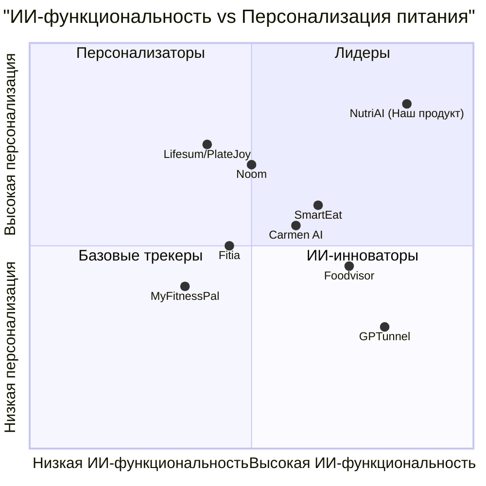

# PRD: NutriAI — ИИ-приложение для правильного питания

## 1. Общая информация

| Параметр | Значение |
|---|---|
| **Язык документа** | Русский |
| **Язык программирования** | TypeScript, Tailwind CSS, Shadcn-ui |
| **Название проекта** | `nutri_ai` |
| **Версия PRD** | 1.3 |
| **Дата** | 2026-03-20 |
| **Приоритетный регион** | РФ/СНГ |
| **Основной язык интерфейса** | Русский |
| **Валюта** | руб (российский рубль) |
| **Demo Frontend** | Vite + React 18 SPA (Atoms Cloud) |
| **Production Frontend** | Next.js 14+ (App Router, SSR) |
| **Demo Backend** | Atoms Cloud (Auth + Database + Storage + Edge Functions) — полный стек |
| **Production Backend** | Atoms Cloud (Auth, Edge Functions) + Yandex Cloud (PostgreSQL, Storage, Deploy) |
| **Платежи** | ЮKassa (https://yookassa.ru/) — только Production |
| **Demo Деплой** | Atoms Cloud (автоматический) |
| **Production Деплой** | Yandex Cloud (Serverless Containers) |
| **ИИ-модели** | gemini-2.5-pro (мультимодальное распознавание еды), gpt-5-chat (генерация планов питания, JSON), claude-4-5-sonnet (чат-бот нутрициолог, рассуждения), gemini-2.5-flash-image (генерация изображений рецептов) |

> **Changelog v1.3**: Добавлен вариант Demo-версии на Atoms Cloud (полный стек). Два режима: Demo (быстрый прототип) и Production (полноценный продукт).
> **Changelog v1.2**: Frontend Production на Next.js 14+ SSR (вместо Vite SPA), деплой на Yandex Cloud, платежи через ЮKassa.

---

## 2. Исходные требования

Создать веб-приложение для правильного питания с использованием ИИ-моделей, которое поможет пользователям:
- Автоматически распознавать еду по фото и получать данные о калорийности и БЖУ
- Получать персонализированные планы питания на основе индивидуальных параметров
- Вести дневник питания с визуальным дашбордом
- Общаться с ИИ-нутрициологом для получения рекомендаций
- Генерировать рецепты под свои цели и ограничения
- Формировать здоровые пищевые привычки с помощью поведенческого ИИ-коуча

Приложение должно занять нишу между простыми счётчиками калорий (MyFitnessPal) и дорогими поведенческими программами (Noom), предлагая комплексный ИИ-подход по доступной цене.

**Приоритетный регион запуска — РФ/СНГ.** Приложение должно быть глубоко локализовано: база российских и региональных продуктов, рецепты русской, кавказской, среднеазиатской и других кухонь СНГ, ценообразование в рублях, интеграция с локальными сервисами доставки продуктов, учёт специфики российского рынка здорового питания.

**Два варианта деплоя:**
- **Demo-версия (Atoms Cloud)**: Быстрый прототип на Vite + React SPA с полным стеком Atoms Cloud (Auth, Database, Storage, Edge Functions). Для демонстрации инвесторам, тестирования гипотез, валидации UX. Запуск за 2-3 недели.
- **Production-версия (Yandex Cloud)**: Next.js 14+ с SSR для SEO и производительности, деплой на Yandex Cloud (соответствие 152-ФЗ), платежи через ЮKassa (поддержка МИР, СБП).

---

## 3. Цели продукта

### Цель 1: Максимальная персонализация питания через ИИ
Создать систему, которая учитывает цели пользователя, аллергии, предпочтения, бюджет, время на готовку, физическую активность и физиологическое состояние для формирования по-настоящему индивидуальных рекомендаций — в отличие от конкурентов, предлагающих шаблонные планы.

### Цель 2: Минимизация усилий пользователя при ведении дневника питания
Сделать процесс логирования еды максимально простым: фото, автоматическое распознавание, подсчёт калорий и БЖУ за 3 секунды. Устранить главный барьер — ручной ввод данных, из-за которого 60% пользователей бросают приложения в первый месяц.

### Цель 3: Формирование устойчивых здоровых привычек
Выйти за рамки простого подсчёта калорий, интегрировав поведенческий ИИ-коучинг, который помогает пользователям понять триггеры переедания, выработать стратегии и сформировать долгосрочные привычки — обеспечивая retention rate выше 40% через 6 месяцев.

---

## 4. Пользовательские истории

| # | Роль | Действие | Выгода |
|---|---|---|---|
| US-1 | Как пользователь из Москвы, следящий за весом | Я хочу сфотографировать борщ со сметаной и мгновенно увидеть калории и БЖУ | Чтобы не тратить время на ручной поиск российских блюд, которых нет в зарубежных базах |
| US-2 | Как человек с аллергией на глютен | Я хочу получить план питания на неделю из доступных в Пятёрочке продуктов, исключающий глютен и укладывающийся в бюджет 5,000 руб/неделю | Чтобы питаться безопасно, разнообразно и не переплачивать |
| US-3 | Как начинающий в правильном питании | Я хочу задать ИИ-нутрициологу вопрос «Чем заменить белый рис в плове?» на русском языке и получить обоснованный ответ с учётом российских продуктов | Чтобы постепенно учиться делать здоровый выбор из того, что продаётся рядом |
| US-4 | Как человек, склонный к эмоциональному перееданию | Я хочу, чтобы приложение распознавало мои паттерны переедания и предлагало альтернативные стратегии | Чтобы разорвать цикл стресс, еда и сформировать здоровые привычки |
| US-5 | Как занятой родитель из Казани | Я хочу получить список покупок на неделю в рублях, сгенерированный из плана питания с рецептами татарской и русской кухни | Чтобы экономить время на планирование и кормить семью вкусно и полезно |
| US-6 | Как пользователь, готовый платить за премиум | Я хочу оплатить подписку картой МИР или через СБП и мгновенно получить доступ к безлимитным функциям | Чтобы не сталкиваться с ограничениями бесплатного тарифа |

---

## 5. Анализ конкурентов

### 5.1 Обзор конкурентов

| Конкурент | Сильные стороны | Слабые стороны |
|---|---|---|
| **MyFitnessPal** | Крупнейшая база продуктов (14M+), сканер штрих-кодов, широкая интеграция с устройствами | Слабая ИИ-персонализация, нет генерации рецептов, устаревший UX, навязчивая реклама в бесплатной версии |
| **Noom** | Лидер в поведенческой психологии (КПТ), человеческий коучинг, доказанная эффективность | Высокая цена ($60/мес), слабое распознавание еды по фото, нет генерации рецептов, ограниченная локализация |
| **Foodvisor** | Лучшее визуальное распознавание еды (CNN), точная оценка порций, чат с диетологом | Нет планирования меню, слабый поведенческий компонент, ограниченная база продуктов для СНГ |
| **SmartEat** | Сканер меню ресторанов, сканер холодильника, консультации с диетологами, комплексный подход | Молодой продукт, ограниченная база пользователей, высокая стоимость консультаций |
| **Carmen AI** | Анализ состава тела по фото, распознавание веса без взвешивания, борьба с ультра-обработанными продуктами | Сильная локализация только для Испании, слабый англоязычный/русскоязычный рынок |
| **Lifesum/PlateJoy** | Глубокая персонализация планов, адаптация рецептов, самообучающаяся система | Нет ИИ-чат-бота, слабое распознавание по фото, нет поведенческого коучинга |
| **GPTunnel** | Агрегатор 100+ ИИ-моделей, гибкая оплата, доступ без VPN для РФ | Не специализирован на питании, нет визуального распознавания, нет структурированного плана питания |
| **Fitia** | Научный подход, автоматический планировщик, популярен в Латинской Америке | Слабая локализация за пределами испаноязычных стран, ограниченный ИИ-функционал |

### 5.2 Конкурентная квадрантная диаграмма



### 5.3 Матрица функций конкурентов

| Функция | MyFitnessPal | Noom | Foodvisor | SmartEat | Carmen AI | Lifesum/PlateJoy | GPTunnel | Fitia | **NutriAI** |
|---|:---:|:---:|:---:|:---:|:---:|:---:|:---:|:---:|:---:|
| Распознавание еды по фото | частично | частично | да | да | да | нет | нет | частично | да |
| Персональный план питания | частично | да | нет | да | да | да | частично | да | да |
| Подсчёт калорий + БЖУ | да | да | да | да | да | да | нет | да | да |
| ИИ-чат-бот нутрициолог | нет | нет | частично | да | частично | нет | да | нет | да |
| Генерация рецептов | нет | нет | нет | да | частично | да | частично | да | да |
| Поведенческий ИИ-коуч | нет | да | нет | нет | частично | нет | нет | нет | да |
| Список покупок | нет | нет | нет | нет | нет | да | нет | да | да |
| Сканер штрих-кодов | да | частично | частично | да | да | частично | нет | да | да |
| Сканер меню ресторана | нет | нет | нет | да | нет | нет | нет | нет | да |
| Интеграция с фитнес-трекерами | да | да | частично | частично | частично | да | нет | частично | да |

---

## 6. Анализ требований

### 6.1 Обзор рынка

#### Глобальный рынок
- **Объём рынка**: $3.66 млрд (2024), прогноз $8.51 млрд (2025)
- **CAGR**: 23.1%
- **Целевая аудитория**: 63+ млн пользователей ИИ-платформ здоровья в США к 2025
- **Ключевые драйверы**: глубокая персонализация, мультимодальный ИИ, интеграция с экосистемами здоровья, поведенческая психология

#### Рынок РФ/СНГ (приоритетный)
- **Объём рынка health-tech в РФ**: ~$1.2 млрд (2024), рост 18-20% в год
- **Пользователи приложений для здоровья в РФ**: ~25 млн (2024), прогноз 40 млн к 2026
- **Проникновение ИИ-приложений питания**: низкое (~3-5%), что создаёт окно возможностей
- **Ключевые особенности рынка РФ/СНГ**:
  - Отсутствие доминирующего локализованного ИИ-решения для питания
  - Noom, Foodvisor, Carmen AI практически не локализованы для РФ
  - MyFitnessPal имеет ограниченную базу российских продуктов
  - GPTunnel доступен без VPN, но не специализирован на питании
  - Растущий интерес к ЗОЖ: 36% россиян следят за питанием (ФОМ, 2024)
  - Средний чек на подписку health-приложений: 300-700 руб/мес
  - Популярные способы оплаты: банковские карты (МИР, Visa, MC), СБП, подписки через RuStore

### 6.2 Целевая аудитория

| Сегмент | Описание | Потребности | Размер |
|---|---|---|---|
| **Следящие за весом** | 25-45 лет, жители крупных городов РФ (Москва, СПб, Казань, Екатеринбург и др.), хотят похудеть или поддерживать вес | Простой подсчёт калорий из российских продуктов, план питания в рублях, мотивация на русском языке | 60% аудитории |
| **Фитнес-энтузиасты** | 20-35 лет, посетители фитнес-клубов (WorldClass, Alex Fitness, DDX и др.), активно тренируются | Точный подсчёт БЖУ, рецепты с высоким содержанием белка из доступных в РФ продуктов, интеграция с трекерами | 20% аудитории |
| **Люди с ограничениями** | Любой возраст, аллергии, диабет, целиакия и др. | Безопасные рецепты из российских продуктов, исключение аллергенов, научно обоснованные рекомендации на русском языке | 12% аудитории |
| **Занятые профессионалы** | 28-50 лет, жители мегаполисов РФ/СНГ, мало времени на готовку | Быстрые рецепты из продуктов Пятёрочки/Перекрёстка/ВкусВилла, автоматический список покупок в руб, минимум усилий | 8% аудитории |

### 6.3 Технические требования

#### 6.3.1 Demo-версия (Atoms Cloud)

| Слой | Технология |
|---|---|
| **Frontend** | Vite + React 18 + TypeScript (SPA) |
| **UI** | Shadcn-ui + Tailwind CSS |
| **Маршрутизация** | React Router v6 |
| **Состояние** | Zustand + TanStack Query v5 |
| **Графики** | Recharts |
| **Auth** | Atoms Cloud Auth (Email + Google OAuth) |
| **БД** | Atoms Cloud Database (PostgreSQL с RLS) |
| **Storage** | Atoms Cloud Storage (фото еды, рецептов) |
| **ИИ** | Atoms Cloud Edge Functions (все 4 модели) |
| **Деплой** | Atoms Cloud (автоматический, нулевая настройка) |

#### 6.3.2 Production-версия (Yandex Cloud)

##### Frontend
- **Фреймворк**: **Next.js 14+ с App Router и SSR**
- **UI-библиотека**: Shadcn-ui + Tailwind CSS
- **Язык**: TypeScript
- **Адаптивность**: Mobile-first дизайн (PWA через next-pwa)
- **Графики**: Recharts для визуализации дашборда питания
- **SSR-стратегия**: SSG для лендинга/блога, SSR для дашборда/профиля, CSR для камеры/чата, ISR для рецептов

##### Backend (Гибридная архитектура)
- **Аутентификация**: Atoms Cloud Auth (email + OAuth Google/VK ID/Яндекс ID)
- **База данных**: **Yandex Managed PostgreSQL** (серверы в РФ, 152-ФЗ)
- **ORM**: Prisma (типобезопасные запросы, миграции)
- **Хранилище файлов**: **Yandex Object Storage** (S3-совместимое, фото еды)
- **CDN**: **Yandex CDN** (раздача статики и изображений)
- **Edge Functions**: Atoms Cloud Edge Functions (вызов ИИ-моделей)
- **API Routes**: Next.js Route Handlers (CRUD, платежи, аналитика)

##### Платежи (только Production)
- **Платёжный сервис**: **ЮKassa** (https://yookassa.ru/)
- **Поддерживаемые методы**: МИР, СБП, Visa, Mastercard, ЮMoney
- **Рекуррентные платежи**: автопродление подписок через сохранённые методы оплаты
- **Вебхуки**: уведомления о статусе платежей (succeeded, cancelled, refunded)
- **Комиссия**: ~3.5% за транзакцию

##### Деплой (Production)
- **Платформа**: **Yandex Cloud** (ru-central1, Москва)
- **Контейнеризация**: Docker, Yandex Container Registry, Yandex Serverless Containers
- **CI/CD**: GitHub Actions, автоматический деплой при push в main
- **Домен**: nutriai.ru (требуется регистрация)
- **SSL**: Let's Encrypt / Yandex Certificate Manager

#### 6.3.3 ИИ-модели (общие для Demo и Production)

| Задача | Модель | Обоснование |
|---|---|---|
| Распознавание еды по фото | `gemini-2.5-pro` | Мультимодальная модель, лучшая для анализа изображений |
| Генерация планов питания | `gpt-5-chat` | Стабильная генерация структурированного JSON |
| ИИ-чат-бот нутрициолог | `claude-4-5-sonnet` | Лучшие рассуждения, эмпатичный тон |
| Поведенческий коуч | `claude-4-5-sonnet` | Глубокий анализ паттернов, деликатная коммуникация |
| Генерация рецептов | `gpt-5-chat` | Структурированный вывод с точными пропорциями |
| Изображения рецептов | `gemini-2.5-flash-image` | Быстрая генерация аппетитных изображений |
| Сканер меню ресторана | `gemini-2.5-pro` | Мультимодальный анализ фото меню |

> Все ИИ-модели вызываются через **Atoms Cloud Edge Functions** — одинаково для Demo и Production.

---

## 7. Пул требований (Requirements Pool)

### P0 — Must Have (MVP)

| ID | Требование | Demo | Production | Описание |
|---|---|:---:|:---:|---|
| R-001 | **Регистрация и онбординг** | да | да | Регистрация через email/Google (Demo) + VK ID/Яндекс ID (Production). Анкета онбординга: пол, возраст, рост, вес, цель, уровень активности, аллергии, диетические предпочтения, город, бюджет (руб/неделя), магазины, время на готовку, количество приёмов пищи, предпочтения кухни |
| R-002 | **ИИ-распознавание еды по фото** | да | да | Фото еды, ИИ (gemini-2.5-pro) распознаёт продукты, оценивает порцию, рассчитывает КБЖУ. Точность более 85%. Время ответа до 5 сек. Ручная корректировка |
| R-003 | **Персональный план питания** | да | да | ИИ (gpt-5-chat) генерирует план на 7 дней. Учитывает КБЖУ, аллергии, бюджет в руб, магазины РФ, кухни СНГ. Регенерация отдельных приёмов |
| R-004 | **Дашборд питания** | да | да | Прогресс-бары КБЖУ, график веса, история приёмов, статистика, тренды |
| R-005 | **ИИ-чат-бот нутрициолог** | да | да | Чат с ИИ (claude-4-5-sonnet) на русском языке. Знает российские продукты, учитывает контекст пользователя |
| R-006 | **Генерация рецептов** | да | да | ИИ (gpt-5-chat) генерирует рецепты + фото (gemini-2.5-flash-image). КБЖУ, ингредиенты, инструкции |
| R-007 | **Дневник питания** | да | да | Ручной ввод, поиск по базе, логирование через фото, история, заметки |
| R-018 | **Подписка и оплата через ЮKassa** | нет | да | ЮKassa: МИР, СБП, Visa, MC, ЮMoney. Рекуррентные платежи. Вебхуки. Тарифы: Бесплатный / Премиум (499 руб/мес) / Премиум+ (799 руб/мес) |

> **Demo-версия**: Все функции R-001 — R-007 доступны без ограничений (нет тарифов). R-018 не реализуется.

### P1 — Should Have (v2.0)

| ID | Требование | Описание |
|---|---|---|
| R-008 | **Поведенческий ИИ-коуч** | ИИ (claude-4-5-sonnet) анализирует паттерны питания, выявляет триггеры переедания, предлагает стратегии, мини-уроки КПТ, мотивационные сообщения |
| R-009 | **Автоматический список покупок** | Генерация из плана питания, группировка по категориям, оценка стоимости в руб, шаринг |
| R-010 | **Сканер штрих-кодов** | Приоритетная база продуктов РФ/СНГ, EAN-13, краудсорсинг, интеграция с дневником |
| R-011 | **Система достижений и геймификация** | Бейджи, серии, челленджи, прогресс-бар |
| R-012 | **Уведомления и напоминания** | Напоминания о приёмах пищи, мотивационные push, еженедельный отчёт |

### P2 — Nice to Have (v3.0)

| ID | Требование | Описание |
|---|---|---|
| R-013 | **Сканер меню ресторана** | Фото меню, ИИ (gemini-2.5-pro) рекомендует блюда, оценка КБЖУ |
| R-014 | **Интеграция с фитнес-трекерами** | Apple Health, Google Fit, Fitbit, Garmin |
| R-015 | **Семейный режим** | Планы для семьи, общий список покупок |
| R-016 | **Водный баланс** | Трекер воды, норма, напоминания |
| R-017 | **Экспорт и отчёты** | PDF/CSV, отчёты для врача, долгосрочная аналитика |

---

## 8. Дизайн пользовательского интерфейса

### 8.1 Структура навигации

```
NutriAI
+-- Главная (Дашборд)
|   +-- Прогресс калорий и БЖУ за сегодня
|   +-- Быстрое добавление еды (фото / поиск / штрих-код)
|   +-- Следующий приём пищи из плана
|   +-- Инсайт дня от ИИ-коуча
|
+-- План питания
|   +-- Недельный план (завтрак/обед/ужин/перекусы)
|   +-- Детали блюда, рецепт
|   +-- Замена блюда (регенерация)
|   +-- Список покупок
|
+-- Добавить еду
|   +-- Фото, ИИ-распознавание
|   +-- Поиск по базе
|   +-- Сканер штрих-кода
|   +-- Ручной ввод
|
+-- ИИ-нутрициолог (Чат)
|   +-- Чат с ИИ
|   +-- Быстрые вопросы (шаблоны)
|   +-- История диалогов
|
+-- Аналитика
|   +-- Дневная/недельная/месячная статистика
|   +-- Графики динамики веса
|   +-- Тренды по нутриентам
|   +-- Достижения и серии
|
+-- Профиль
    +-- Личные данные и цели
    +-- Диетические ограничения
    +-- Подключённые устройства
    +-- Настройки уведомлений
    +-- Подписка и оплата (ЮKassa) — только Production
```

### 8.2 Ключевые экраны

#### Экран 1: Дашборд (Главная)
```
+-------------------------------------+
|  NutriAI          Профиль           |
+-------------------------------------+
|                                     |
|  Привет, Анна!                      |
|  Сегодня: 1,240 / 1,800 ккал       |
|                                     |
|  +-----------------------------+    |
|  | ============-----  69%      |    |
|  | Калории: 1,240 / 1,800     |    |
|  |                             |    |
|  | Б: 82г/120г  Ж: 45г/60г   |    |
|  | У: 156г/200г               |    |
|  +-----------------------------+    |
|                                     |
|  +------------------------------+   |
|  | Добавить еду                 |   |
|  | [Фото] [Поиск] [Штрих-код]  |   |
|  +------------------------------+   |
|                                     |
|  Следующий приём: Обед 13:00        |
|  +------------------------------+   |
|  | Салат с курицей и киноа      |   |
|  | 420 ккал | 35г Б | 18г Ж   |   |
|  | [Открыть рецепт] [Заменить] |   |
|  +------------------------------+   |
|                                     |
|  Инсайт от ИИ-коуча:               |
|  "Вы отлично справляетесь с        |
|  белком! Попробуйте добавить       |
|  больше клетчатки в обед."         |
|                                     |
+-------------------------------------+
|  Дашборд | План | + | Чат | Стат   |
+-------------------------------------+
```

#### Экран 2: ИИ-распознавание еды
```
+-------------------------------------+
|  <- Добавить еду                    |
+-------------------------------------+
|                                     |
|  +------------------------------+   |
|  |      [Фото тарелки]         |   |
|  +------------------------------+   |
|                                     |
|  Распознано:                        |
|                                     |
|  +------------------------------+   |
|  | Куриная грудка  ~150г        |   |
|  |    231 ккал | 43г Б | 5г Ж  |   |
|  |    [Изменить порцию]         |   |
|  +------------------------------+   |
|  | Бурый рис  ~200г             |   |
|  |    248 ккал | 5г Б | 2г Ж   |   |
|  |    [Изменить порцию]         |   |
|  +------------------------------+   |
|  | Салат из огурцов  ~100г      |   |
|  |    15 ккал | 1г Б | 0г Ж    |   |
|  |    [Изменить порцию]         |   |
|  +------------------------------+   |
|                                     |
|  Итого: 494 ккал | 49г Б | 7г Ж   |
|                                     |
|  [+ Добавить продукт]              |
|                                     |
|  +------------------------------+   |
|  |     Сохранить в дневник      |   |
|  +------------------------------+   |
+-------------------------------------+
```

#### Экран 3: ИИ-чат-бот нутрициолог
```
+-------------------------------------+
|  <- ИИ-нутрициолог                  |
+-------------------------------------+
|                                     |
|  Бот: Привет! Я ваш ИИ-            |
|  нутрициолог. Задайте любой         |
|  вопрос о питании.                  |
|                                     |
|  Вы: Чем заменить белый рис,       |
|  если я на низкоуглеводной          |
|  диете?                             |
|                                     |
|  Бот: Отличный вопрос! Вот          |
|  несколько альтернатив:             |
|                                     |
|  1. Цветная капуста (5г У)          |
|     Самая низкоуглеводная замена    |
|  2. Киноа (21г У)                   |
|     Больше белка, полноценный       |
|     аминокислотный профиль          |
|  3. Булгур (19г У)                  |
|     Больше клетчатки, дольше        |
|     насыщает                        |
|                                     |
|  Учитывая вашу цель похудения,      |
|  рекомендую цветную капусту -       |
|  всего 25 ккал на 100г!            |
|                                     |
|  Быстрые вопросы:                   |
|  [Что съесть на ужин?]              |
|  [Как увеличить белок?]             |
|  [Здоровые перекусы]                |
|                                     |
+-------------------------------------+
|  [Введите сообщение...]    [Отпр]  |
+-------------------------------------+
```

---

## 9. Архитектура данных

### 9.1 Основные сущности

```
Users
- id (UUID, PK)
- email (string, unique)
- name (string)
- avatar_url (string, nullable)
- created_at (timestamp)
- updated_at (timestamp)

UserProfiles
- id (UUID, PK)
- user_id (UUID, FK -> Users)
- gender (enum: male/female/other)
- birth_date (date)
- height_cm (number)
- current_weight_kg (number)
- target_weight_kg (number)
- goal (enum: lose/gain/maintain)
- activity_level (enum: sedentary/light/moderate/active/very_active)
- allergies (string[])
- dietary_preferences (string[])
- cuisine_preferences (string[]) - русская, кавказская, среднеазиатская, европейская и др.
- budget_per_week (number) - в руб
- budget_currency (string, default: 'RUB')
- preferred_stores (string[]) - Пятёрочка, Перекрёсток, ВкусВилл, Магнит и др.
- city (string) - город проживания для локализации
- locale (string, default: 'ru-RU') - локаль пользователя
- cooking_time_minutes (number)
- meals_per_day (number)
- daily_calories_target (number, computed)
- daily_protein_target (number, computed)
- daily_fat_target (number, computed)
- daily_carbs_target (number, computed)
- updated_at (timestamp)

MealLogs
- id (UUID, PK)
- user_id (UUID, FK -> Users)
- meal_type (enum: breakfast/lunch/dinner/snack)
- logged_at (timestamp)
- photo_url (string, nullable)
- total_calories (number)
- total_protein (number)
- total_fat (number)
- total_carbs (number)
- notes (string, nullable)
- items (JSON: [{name, portion_g, calories, protein, fat, carbs}])

MealPlans
- id (UUID, PK)
- user_id (UUID, FK -> Users)
- week_start_date (date)
- plan_data (JSON: {days: [{meals: [{type, recipe_id, name, calories, protein, fat, carbs}]}]})
- generated_at (timestamp)
- status (enum: active/archived)

Recipes
- id (UUID, PK)
- user_id (UUID, FK -> Users, nullable)
- name (string)
- description (string)
- image_url (string, nullable)
- ingredients (JSON: [{name, amount, unit}])
- instructions (string[])
- prep_time_minutes (number)
- cook_time_minutes (number)
- servings (number)
- calories_per_serving (number)
- protein_per_serving (number)
- fat_per_serving (number)
- carbs_per_serving (number)
- tags (string[])
- dietary_flags (string[])
- created_at (timestamp)

ChatMessages
- id (UUID, PK)
- user_id (UUID, FK -> Users)
- role (enum: user/assistant)
- content (string)
- context (JSON, nullable)
- created_at (timestamp)

WeightLogs
- id (UUID, PK)
- user_id (UUID, FK -> Users)
- weight_kg (number)
- logged_at (timestamp)
- notes (string, nullable)

ShoppingLists
- id (UUID, PK)
- user_id (UUID, FK -> Users)
- meal_plan_id (UUID, FK -> MealPlans)
- items (JSON: [{name, amount, unit, category, checked}])
- estimated_cost (number, nullable)
- created_at (timestamp)

FoodDatabase (общая для всех пользователей)
- id (UUID, PK)
- name (string)
- brand (string, nullable)
- barcode (string, nullable, INDEX)
- calories_per_100g (number)
- protein_per_100g (number)
- fat_per_100g (number)
- carbs_per_100g (number)
- category (string)
- region (string, default: 'RU')
- verified (boolean, default: false)
- created_at (timestamp)

Subscriptions (только Production)
- id (UUID, PK)
- user_id (UUID, FK -> Users, UNIQUE)
- tier (enum: free/premium/premium_plus)
- status (enum: active/cancelled/expired/past_due)
- current_period_start (timestamp)
- current_period_end (timestamp)
- yookassa_payment_method_id (string, nullable)
- cancel_at_period_end (boolean, default: false)
- created_at (timestamp)
- updated_at (timestamp)

Payments (только Production)
- id (UUID, PK)
- user_id (UUID, FK -> Users)
- subscription_id (UUID, FK -> Subscriptions)
- yookassa_payment_id (string, UNIQUE)
- amount (decimal)
- currency (string, default: 'RUB')
- status (enum: pending/succeeded/cancelled/refunded)
- description (string)
- payment_method_type (string)
- created_at (timestamp)
- updated_at (timestamp)
```

---

## 10. Роадмап

### Фаза 0: Demo-версия на Atoms Cloud (2-3 недели)

| Неделя | Задачи |
|---|---|
| 1 | Настройка Atoms Cloud (Auth, DB, Storage, Edge Functions), аутентификация (Email + Google), онбординг-анкета |
| 2 | ИИ-распознавание еды (gemini-2.5-pro), дневник питания, план питания (gpt-5-chat), ИИ-чат (claude-4-5-sonnet) |
| 3 | Дашборд (Recharts), генерация рецептов, аналитика, деплой Demo |

### Фаза 1: Production MVP (10-12 недель)

| Неделя | Задачи |
|---|---|
| 1-2 | Миграция на Next.js 14+ App Router, подключение Yandex Managed PostgreSQL, Prisma, аутентификация (+ VK ID, Яндекс ID) |
| 3-4 | Перенос ИИ-функций (Edge Functions без изменений), распознавание еды, дневник питания |
| 5-6 | Генерация плана питания, генерация рецептов с изображениями |
| 7-8 | Дашборд (SSR + CSR), визуализация прогресса, аналитика |
| 9 | ИИ-чат-бот нутрициолог |
| 10 | Интеграция ЮKassa (подписки, вебхуки, управление тарифами) |
| 11-12 | Тестирование, оптимизация, деплой на Yandex Cloud |

### Фаза 2: v2.0 (6-8 недель)

| Неделя | Задачи |
|---|---|
| 1-2 | Поведенческий ИИ-коуч, мини-уроки по психологии питания |
| 3-4 | Автоматический список покупок, шаринг |
| 5-6 | Сканер штрих-кодов, локализованная база продуктов РФ/СНГ |
| 7-8 | Геймификация, уведомления, оптимизация |

### Фаза 3: v3.0 (6-8 недель)

| Неделя | Задачи |
|---|---|
| 1-2 | Сканер меню ресторана (gemini-2.5-pro) |
| 3-4 | Интеграция с фитнес-трекерами (Apple Health, Google Fit) |
| 5-6 | Семейный режим, водный баланс |
| 7-8 | Экспорт отчётов, долгосрочная аналитика |

---

## 11. Метрики успеха

| Метрика | Цель (Demo) | Цель (MVP Production) | Цель (6 мес) | Цель (12 мес) |
|---|---|---|---|---|
| Пользователи | 50-100 тестеров | 500 DAU | 5,000 DAU | 25,000 DAU |
| Retention D7 | 50% (тестеры) | 40% | 50% | 55% |
| Retention D30 | — | 20% | 30% | 35% |
| Среднее логов еды/день | 2.0 | 2.0 | 2.5 | 3.0 |
| Точность распознавания | более 85% | более 85% | более 88% | более 92% |
| NPS | 30 | 30 | 45 | 55 |
| Конверсия Free, Premium | — | — | 5% | 8% |
| MRR | — | — | 125,000 руб | 1,000,000 руб |

---

## 12. Модель монетизации (только Production)

| Тариф | Цена | Функции |
|---|---|---|
| **Бесплатный** | 0 руб | Дневник питания (ручной ввод), 3 фото-распознавания/день, базовый дашборд, 5 сообщений ИИ-чату/день |
| **Премиум** | 499 руб/мес (4,990 руб/год) | Безлимитное фото-распознавание, персональный план питания, безлимитный ИИ-чат, генерация рецептов, список покупок в руб, аналитика |
| **Премиум+** | 799 руб/мес (7,990 руб/год) | Всё из Премиум + поведенческий ИИ-коуч, сканер меню ресторана, интеграция с трекерами, семейный режим, приоритетная поддержка |

> **Demo-версия**: Все функции доступны без ограничений и без оплаты.
> **Платёжный сервис (Production)**: ЮKassa (https://yookassa.ru/)
> **Способы оплаты**: банковские карты (МИР, Visa, Mastercard), СБП, ЮMoney
> **Рекуррентные платежи**: автопродление через сохранённые методы оплаты ЮKassa
> **Годовая подписка** = скидка ~17%
> **Комиссия ЮKassa**: ~3.5% за транзакцию
> **Дистрибуция**: веб (nutriai.ru), RuStore (PWA-обёртка), App Store/Google Play (v2.0+)

---

## 13. Открытые вопросы

| # | Вопрос | Влияние | Статус |
|---|---|---|---|
| 1 | ~~Какой регион является приоритетным для запуска?~~ | ~~Определяет базу продуктов, локализацию, ценообразование~~ | Решено: РФ/СНГ |
| 2 | Нужна ли интеграция с реальными диетологами (как в SmartEat/Noom) или только ИИ? | Влияет на операционные расходы и позиционирование | Требует решения |
| 3 | Какой уровень медицинской ответственности? Нужен ли дисклеймер? | Юридические риски | Требует решения |
| 4 | Планируется ли нативное мобильное приложение или достаточно PWA? | Доступ к камере, push-уведомления, App Store | Требует решения |
| 5 | Какой бюджет на ИИ-инфраструктуру (API-вызовы моделей) на начальном этапе? | Определяет лимиты бесплатного тарифа | Требует решения |
| 6 | ~~Нужна ли поддержка офлайн-режима?~~ | ~~Архитектура и UX~~ | Решено: Нет в MVP |
| 7 | ~~Какой фреймворк для frontend?~~ | ~~SSR vs SPA~~ | Решено: Demo — Vite SPA, Production — Next.js 14+ SSR |
| 8 | ~~Где деплоить?~~ | ~~152-ФЗ, производительность~~ | Решено: Demo — Atoms Cloud, Production — Yandex Cloud |
| 9 | ~~Какой платёжный сервис?~~ | ~~МИР, СБП, рекуррентные~~ | Решено: ЮKassa (Production) |

---

## 14. УТП (Уникальное торговое предложение)

**NutriAI — первое ИИ-приложение для правильного питания, созданное для России и СНГ:**

1. **Мгновенное ИИ-распознавание еды** — сфотографируй борщ, плов или шашлык, КБЖУ за 3 секунды
2. **Умный ИИ-нутрициолог на русском языке**, который знает российские продукты, ваши цели и историю
3. **Персональные планы питания** из продуктов Пятёрочки и ВкусВилла с учётом бюджета в руб
4. **Рецепты русской, кавказской и среднеазиатской кухни**, адаптированные под ваши цели
5. **Поведенческий ИИ-коуч**, формирующий устойчивые привычки
6. **Автоматический список покупок в руб** — от плана до магазина в один клик

> **Позиционирование**: «Ваш персональный ИИ-нутрициолог, который знает российские продукты и понимает вас лучше с каждым днём»

**Ключевое отличие от конкурентов на рынке РФ/СНГ:**
- В отличие от MyFitnessPal — знает российские продукты и бренды, а не только западные
- В отличие от Noom — полностью на русском языке и в 10 раз дешевле (499 руб vs $60)
- В отличие от GPTunnel — специализирован на питании с визуальным распознаванием и структурированными планами
- В отличие от всех конкурентов — предлагает **полный цикл** от распознавания еды до формирования привычек, глубоко локализованный для РФ/СНГ

---

## 15. Стратегия локализации РФ/СНГ

### 15.1 База продуктов

#### Приоритетные источники данных
- **Российские бренды**: Простоквашино, Домик в деревне, Макфа, Мираторг, Индилайт, ВкусВилл, Агуша, Фрутоняня, Махеевъ, Heinz Россия, Bonduelle Россия, Barilla Россия и др.
- **Торговые сети**: собственные торговые марки (СТМ) Пятёрочки, Перекрёстка, Магнита, Ленты, ВкусВилла
- **Региональные продукты**: местные молочные заводы, хлебозаводы, мясокомбинаты по регионам
- **Продукты СНГ**: казахстанские, узбекские, грузинские, армянские бренды

#### Структура базы
- **Начальный объём (MVP)**: 50,000+ российских продуктов с КБЖУ
- **Источники**: парсинг данных с сайтов торговых сетей, Open Food Facts (российский сегмент), краудсорсинг от пользователей
- **Верификация**: модерация пользовательских данных + автоматическая валидация ИИ
- **Обновление**: еженедельное добавление новых продуктов, отслеживание сезонных товаров

### 15.2 Рецепты и кухни

#### Поддерживаемые кухни (приоритет)
| Кухня | Примеры блюд | Приоритет |
|---|---|---|
| **Русская** | Борщ, щи, пельмени, блины, каши, котлеты, винегрет, оливье | MVP |
| **Кавказская** | Шашлык, хинкали, хачапури, долма, лобио, аджапсандали | MVP |
| **Среднеазиатская** | Плов, лагман, манты, самса, шурпа, бешбармак | MVP |
| **Европейская** | Паста, салаты, стейки, супы-пюре, ризотто | MVP |
| **Азиатская** | Вок, суши/роллы (адаптированные), рамен, карри | v2.0 |
| **Диетическая/ПП** | Боулы, смузи, протеиновые блюда, low-carb рецепты | MVP |

#### Особенности генерации рецептов для РФ
- Ингредиенты из российских магазинов с указанием примерной цены в руб
- Учёт сезонности продуктов в России (свежие ягоды летом, корнеплоды зимой)
- Адаптация порций под российские стандарты (граммы, столовые ложки)
- Рецепты для мультиварки (популярна в РФ) наряду с плитой и духовкой

### 15.3 Интеграция с локальными сервисами

| Сервис | Тип интеграции | Demo | Production |
|---|---|:---:|:---:|
| **Google OAuth** | Авторизация | да | да |
| **Яндекс ID / VK ID** | Авторизация | нет | да |
| **ЮKassa** | Платежи | нет | да |
| **Atoms Cloud** | Auth + DB + Storage + Edge Functions | да (полный стек) | да (Auth + Edge Functions) |
| **Yandex Cloud** | Деплой, БД, Storage, CDN | нет | да |
| **Яндекс Лавка / Самокат** | Заказ продуктов (deep link) | нет | v2.0 |
| **СберМаркет / Купер** | Заказ продуктов (deep link) | нет | v2.0 |
| **RuStore** | Дистрибуция + подписки | нет | да |
| **Telegram Bot** | Логирование еды, напоминания | нет | v2.0 |
| **VK Mini Apps** | Виджет для ВКонтакте | нет | v3.0 |

### 15.4 Маркетинговая стратегия для РФ/СНГ

#### Каналы привлечения
1. **Telegram** — основной канал: бот-ассистент, канал с рецептами и советами, реклама у ЗОЖ-блогеров
2. **VK** — таргетированная реклама, сообщество, Mini App
3. **YouTube / Rutube** — видео-контент: обзоры рецептов, истории пользователей
4. **Яндекс Директ** — контекстная реклама по запросам «подсчёт калорий», «план питания», «ПП рецепты»
5. **Коллаборации** — фитнес-клубы (WorldClass, Alex Fitness), ЗОЖ-блогеры, нутрициологи

#### Позиционирование для РФ
- **Слоган**: «NutriAI — твой ИИ-нутрициолог, который знает российские продукты»
- **Акцент**: доступная цена (499 руб/мес vs $60 у Noom), русский язык, российские продукты и рецепты
- **Доверие**: партнёрство с российскими нутрициологами, научная база, прозрачность ИИ-рекомендаций

### 15.5 Юридические аспекты РФ

- **152-ФЗ «О персональных данных»**: Production — данные в **Yandex Managed PostgreSQL** (серверы в Москве, РФ). Demo — Atoms Cloud (для прототипа, не для production с персональными данными граждан РФ)
- **Дисклеймер**: «Приложение не является медицинским устройством. Рекомендации носят информационный характер. При наличии заболеваний проконсультируйтесь с врачом»
- **Оферта и политика конфиденциальности**: на русском языке, в соответствии с законодательством РФ
- **Возврат средств**: в соответствии с ФЗ «О защите прав потребителей» и правилами ЮKassa
- **54-ФЗ (онлайн-кассы)**: ЮKassa обеспечивает формирование чеков через партнёрские ОФД